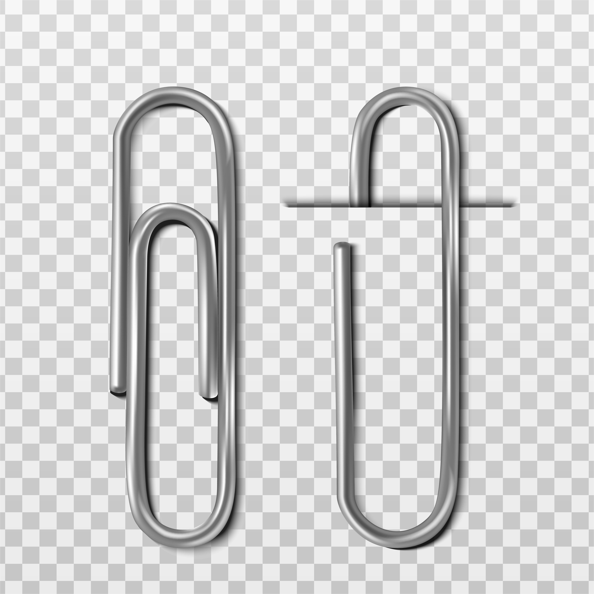

# PDF2PDF: PDF layout converter

<div align="center">


</div>

System for converting pdf documents of any format/model/layout into a new and unified pdf automatically. The main use case is to create a neat and clean compilation of practice exercises from textbooks and other exams, so I can use and solve daily.  

Some similar projects for future reference:
- [PDF2Exam](https://github.com/onluyen/PDF2Exam)
- [PDF Plumber](https://github.com/jsvine/pdfplumber)
- [PDF miner](https://github.com/pdfminer/pdfminer.six)
- [GROBID](https://github.com/kermitt2/grobid)

 

## 💻 Requirements

Before downloading, certify that you have the following requirements:
* You have the most recent version of `python`
* Your operating system is `Windows/Linux` based.

## 🚀 Installing PDF2PDF: PDF layout converter

To run PDF2PDF: PDF layout converter, run the following commands:

```
pip install -r requirements.txt
```

Lauching the application:

```
python3 main.py
```
## Current Version: WIP

This software is a work in progress. For now there are only test codes. Implementation/Tech recommendations are more than welcomed! The full version will be capable of/have implemented:

<details open>
<summary>Features</summary>

- [ ] Execution by command line (see [Installation](#🚀-Installing-PDF2PDF:-PDF-layout-converter)).
- [ ] Web Crawler to collect desired pdfs automatically.
- [ ] Multimodel approach to retrieve the important information from the collected pdfs. See [here](https://ljvmiranda921.github.io/notebook/2022/06/19/document-processing-framework/) for more info.
- [ ] Database to save information.
- [ ] Final document layout definition option and configuration.
- [ ] Python-based script to parse collect info by the trained ML model.
- [ ] Automatic feedback and update system.

</details>

## 📝 License

See [License](LICENSE) for more information.

[⬆ Back to the top](#PDF2PDF:-PDF-layout-converter)<br>

